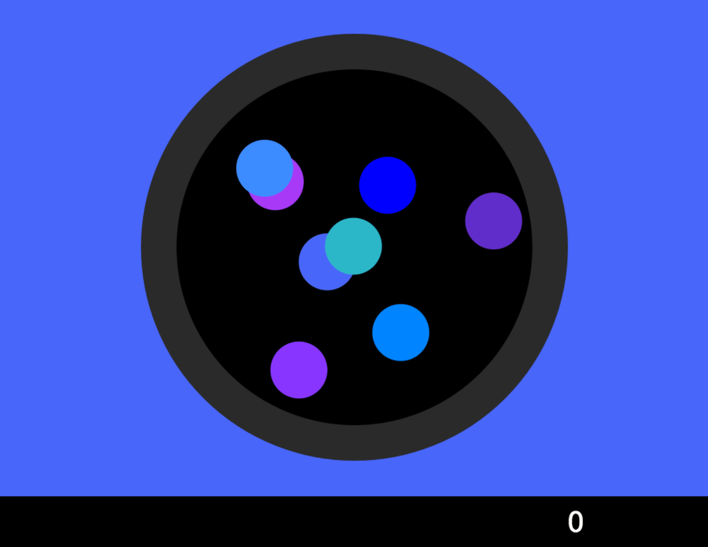

# Amoeba

[Amoeba](http://www.amoeba.fun/)

## Background
Amoeba is a color matching game of perception inspired by the color theory of [Josef Albers' "Interaction of Color"](https://itunes.apple.com/us/app/interaction-of-color-by-josef-albers/id664296461?mt=8) and the game [Specimen](https://www.producthunt.com/posts/specimen-a-game-about-color).

A long term student of color theory, I wanted to test color perception in a way that was meditative and calming. A welcome break from my regular computer screen.

## How it works

Playing the game itself is simple, depending on your perception abilities.
Users must decide which amoeba matches the current background by clicking on the circle. If the amoeba is the matching color, the amoeba pops and a new palette is generated for the remaining amoebas. If the last amoeba, then a new Array of amoebas is created. There is currently no end to the game! Amoebas forever.

## Collision Detection / Libraries

What makes the Amoebas, well, amoebas, is the physics implemented to mimic floating inside a petri dish. Every time an amoeba is drawn, it is checked for collision.

Palettes are randomly generated using the distinct-colors library. A random palate is generated by the current number of amoebas, a random minimum hue, and a maximum hue. The color combinations are nearly infinite.

